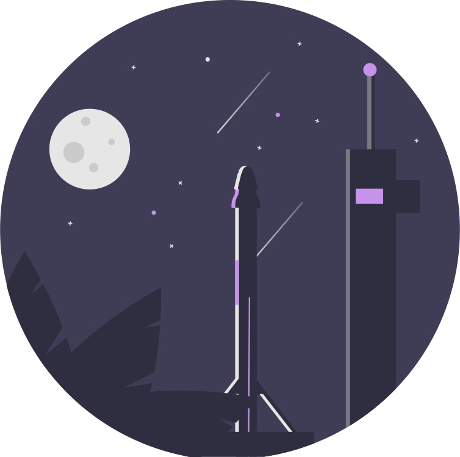
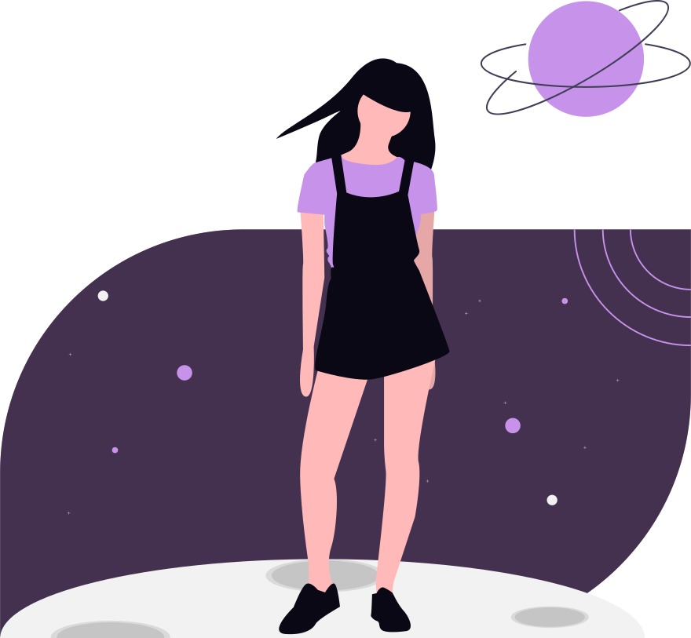

  

# Hello there 👋

  
  
  
  
  

My Name is **Sonja** and I'm a future web developer, who just started into this new world.

<!-- 
 -->

---

## About Me

<ul>
<li><svg xmlns="http://www.w3.org/2000/svg" viewBox="0 0 448 512" height="18"><!--!Font Awesome Free 6.7.2 by @fontawesome - https://fontawesome.com License - https://fontawesome.com/license/free Copyright 2025 Fonticons, Inc.--><path fill="#c792ea" d="M370.7 96.1C346.1 39.5 289.7 0 224 0S101.9 39.5 77.3 96.1C60.9 97.5 48 111.2 48 128l0 64c0 16.8 12.9 30.5 29.3 31.9C101.9 280.5 158.3 320 224 320s122.1-39.5 146.7-96.1c16.4-1.4 29.3-15.1 29.3-31.9l0-64c0-16.8-12.9-30.5-29.3-31.9zM336 144l0 16c0 53-43 96-96 96l-32 0c-53 0-96-43-96-96l0-16c0-26.5 21.5-48 48-48l128 0c26.5 0 48 21.5 48 48zM189.3 162.7l-6-21.2c-.9-3.3-3.9-5.5-7.3-5.5s-6.4 2.2-7.3 5.5l-6 21.2-21.2 6c-3.3 .9-5.5 3.9-5.5 7.3s2.2 6.4 5.5 7.3l21.2 6 6 21.2c.9 3.3 3.9 5.5 7.3 5.5s6.4-2.2 7.3-5.5l6-21.2 21.2-6c3.3-.9 5.5-3.9 5.5-7.3s-2.2-6.4-5.5-7.3l-21.2-6zM112.7 316.5C46.7 342.6 0 407 0 482.3C0 498.7 13.3 512 29.7 512l98.3 0 0-64c0-17.7 14.3-32 32-32l128 0c17.7 0 32 14.3 32 32l0 64 98.3 0c16.4 0 29.7-13.3 29.7-29.7c0-75.3-46.7-139.7-112.7-165.8C303.9 338.8 265.5 352 224 352s-79.9-13.2-111.3-35.5zM176 448c-8.8 0-16 7.2-16 16l0 48 32 0 0-48c0-8.8-7.2-16-16-16zm96 32a16 16 0 1 0 0-32 16 16 0 1 0 0 32z"/></svg> I’m currently working on something new to learn.</li>
<li><svg xmlns="http://www.w3.org/2000/svg" viewBox="0 0 512 512" height="18"><!--!Font Awesome Free 6.7.2 by @fontawesome - https://fontawesome.com License - https://fontawesome.com/license/free Copyright 2025 Fonticons, Inc.--><path fill="#c792ea" d="M512 32c0 113.6-84.6 207.5-194.2 222c-7.1-53.4-30.6-101.6-65.3-139.3C290.8 46.3 364 0 448 0l32 0c17.7 0 32 14.3 32 32zM0 96C0 78.3 14.3 64 32 64l32 0c123.7 0 224 100.3 224 224l0 32 0 160c0 17.7-14.3 32-32 32s-32-14.3-32-32l0-160C100.3 320 0 219.7 0 96z"/></svg> I’m currently learning React.</li>
<li><svg xmlns="http://www.w3.org/2000/svg" viewBox="0 0 384 512" height="18"><!--!Font Awesome Free 6.7.2 by @fontawesome - https://fontawesome.com License - https://fontawesome.com/license/free Copyright 2025 Fonticons, Inc.--><path fill="#c792ea" d="M272 384c9.6-31.9 29.5-59.1 49.2-86.2c0 0 0 0 0 0c5.2-7.1 10.4-14.2 15.4-21.4c19.8-28.5 31.4-63 31.4-100.3C368 78.8 289.2 0 192 0S16 78.8 16 176c0 37.3 11.6 71.9 31.4 100.3c5 7.2 10.2 14.3 15.4 21.4c0 0 0 0 0 0c19.8 27.1 39.7 54.4 49.2 86.2l160 0zM192 512c44.2 0 80-35.8 80-80l0-16-160 0 0 16c0 44.2 35.8 80 80 80zM112 176c0 8.8-7.2 16-16 16s-16-7.2-16-16c0-61.9 50.1-112 112-112c8.8 0 16 7.2 16 16s-7.2 16-16 16c-44.2 0-80 35.8-80 80z"/></svg> I’m looking for help with getting started and ideas for first projects.</li>
<li><svg xmlns="http://www.w3.org/2000/svg" viewBox="0 0 512 512" height="18"><!--!Font Awesome Free 6.7.2 by @fontawesome - https://fontawesome.com License - https://fontawesome.com/license/free Copyright 2025 Fonticons, Inc.--><path fill="#c792ea" d="M48 64C21.5 64 0 85.5 0 112c0 15.1 7.1 29.3 19.2 38.4L236.8 313.6c11.4 8.5 27 8.5 38.4 0L492.8 150.4c12.1-9.1 19.2-23.3 19.2-38.4c0-26.5-21.5-48-48-48L48 64zM0 176L0 384c0 35.3 28.7 64 64 64l384 0c35.3 0 64-28.7 64-64l0-208L294.4 339.2c-22.8 17.1-54 17.1-76.8 0L0 176z"/></svg> How to reach me: nimitya (Discord), nimiitya (Instagram)</li>
<li><svg xmlns="http://www.w3.org/2000/svg" viewBox="0 0 512 512" height="18"><!--!Font Awesome Free 6.7.2 by @fontawesome - https://fontawesome.com License - https://fontawesome.com/license/free Copyright 2025 Fonticons, Inc.--><path fill="#c792ea" d="M464 256A208 208 0 1 0 48 256a208 208 0 1 0 416 0zM0 256a256 256 0 1 1 512 0A256 256 0 1 1 0 256zm349.5 52.4c18.7-4.4 35.9 12 25.5 28.1C350.4 374.6 306.3 400 255.9 400s-94.5-25.4-119.1-63.5c-10.4-16.1 6.8-32.5 25.5-28.1c28.9 6.8 60.5 10.5 93.6 10.5s64.7-3.7 93.6-10.5zM217.6 228.8s0 0 0 0c0 0 0 0 0 0l-.2-.2c-.2-.2-.4-.5-.7-.9c-.6-.8-1.6-2-2.8-3.4c-2.5-2.8-6-6.6-10.2-10.3c-8.8-7.8-18.8-14-27.7-14s-18.9 6.2-27.7 14c-4.2 3.7-7.7 7.5-10.2 10.3c-1.2 1.4-2.2 2.6-2.8 3.4c-.3 .4-.6 .7-.7 .9l-.2 .2c0 0 0 0 0 0c0 0 0 0 0 0s0 0 0 0c-2.1 2.8-5.7 3.9-8.9 2.8s-5.5-4.1-5.5-7.6c0-17.9 6.7-35.6 16.6-48.8c9.8-13 23.9-23.2 39.4-23.2s29.6 10.2 39.4 23.2c9.9 13.2 16.6 30.9 16.6 48.8c0 3.4-2.2 6.5-5.5 7.6s-6.9 0-8.9-2.8c0 0 0 0 0 0s0 0 0 0zm160 0c0 0 0 0 0 0l-.2-.2c-.2-.2-.4-.5-.7-.9c-.6-.8-1.6-2-2.8-3.4c-2.5-2.8-6-6.6-10.2-10.3c-8.8-7.8-18.8-14-27.7-14s-18.9 6.2-27.7 14c-4.2 3.7-7.7 7.5-10.2 10.3c-1.2 1.4-2.2 2.6-2.8 3.4c-.3 .4-.6 .7-.7 .9l-.2 .2c0 0 0 0 0 0c0 0 0 0 0 0s0 0 0 0c-2.1 2.8-5.7 3.9-8.9 2.8s-5.5-4.1-5.5-7.6c0-17.9 6.7-35.6 16.6-48.8c9.8-13 23.9-23.2 39.4-23.2s29.6 10.2 39.4 23.2c9.9 13.2 16.6 30.9 16.6 48.8c0 3.4-2.2 6.5-5.5 7.6s-6.9 0-8.9-2.8c0 0 0 0 0 0s0 0 0 0s0 0 0 0z"/></svg> Fun fact: I love dragons! <svg xmlns="http://www.w3.org/2000/svg" viewBox="0 0 640 512" height="18"><!--!Font Awesome Free 6.7.2 by @fontawesome - https://fontawesome.com License - https://fontawesome.com/license/free Copyright 2025 Fonticons, Inc.--><path fill="#c792ea" d="M352 124.5l-51.9-13c-6.5-1.6-11.3-7.1-12-13.8s2.8-13.1 8.7-16.1l40.8-20.4L294.4 28.8c-5.5-4.1-7.8-11.3-5.6-17.9S297.1 0 304 0L416 0l32 0 16 0c30.2 0 58.7 14.2 76.8 38.4l57.6 76.8c6.2 8.3 9.6 18.4 9.6 28.8c0 26.5-21.5 48-48 48l-21.5 0c-17 0-33.3-6.7-45.3-18.7L480 160l-32 0 0 21.5c0 24.8 12.8 47.9 33.8 61.1l106.6 66.6c32.1 20.1 51.6 55.2 51.6 93.1C640 462.9 590.9 512 530.2 512L496 512l-64 0L32.3 512c-3.3 0-6.6-.4-9.6-1.4C13.5 507.8 6 501 2.4 492.1C1 488.7 .2 485.2 0 481.4c-.2-3.7 .3-7.3 1.3-10.7c2.8-9.2 9.6-16.7 18.6-20.4c3-1.2 6.2-2 9.5-2.2L433.3 412c8.3-.7 14.7-7.7 14.7-16.1c0-4.3-1.7-8.4-4.7-11.4l-44.4-44.4c-30-30-46.9-70.7-46.9-113.1l0-45.5 0-57zM512 72.3c0-.1 0-.2 0-.3s0-.2 0-.3l0 .6zm-1.3 7.4L464.3 68.1c-.2 1.3-.3 2.6-.3 3.9c0 13.3 10.7 24 24 24c10.6 0 19.5-6.8 22.7-16.3zM130.9 116.5c16.3-14.5 40.4-16.2 58.5-4.1l130.6 87 0 27.5c0 32.8 8.4 64.8 24 93l-232 0c-6.7 0-12.7-4.2-15-10.4s-.5-13.3 4.6-17.7L171 232.3 18.4 255.8c-7 1.1-13.9-2.6-16.9-9s-1.5-14.1 3.8-18.8L130.9 116.5z"/></svg></li>
</ul>

---

## Tools:

---

## My Stats :

<picture>
  <source media="(prefers-color-scheme: dark)" srcset="https://github-readme-stats.vercel.app/api/top-langs/?username=nimitaya&theme=nightowl&show_icons=true&hide_border=false&layout=compact">
  
</picture>

<picture>
  <source media="(prefers-color-scheme: dark)" srcset="https://github-readme-stats.vercel.app/api?username=nimitaya&theme=nightowl&show_icons=true&hide_border=false&count_private=true">
  
</picture>

<!-- Dark:

 -->

<!-- Light:

 -->

<!-- Used for view Counter https://github.com/antonkomarev/github-profile-views-counter -->

<!-- <h1 style="color: #c792ea">Hello there 👋</h1> -->
<!-- # $$\color{#c792ea} Hello \space there $$ -->