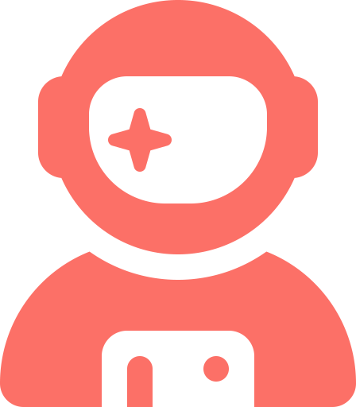
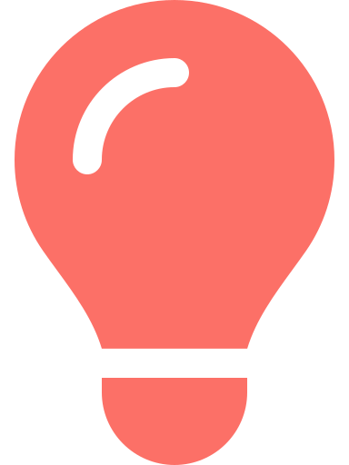
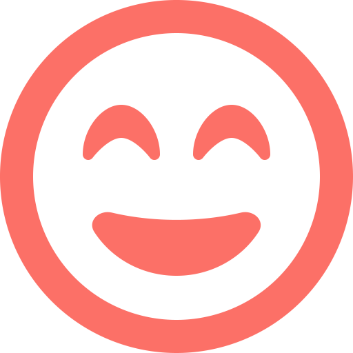
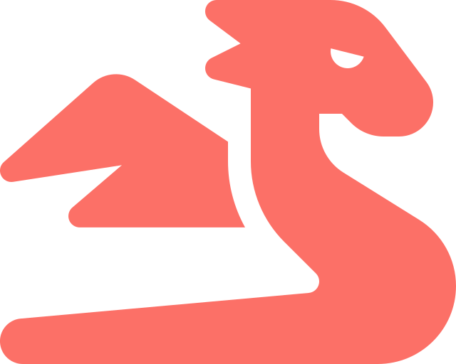

  

# Hello there 

  
  
  
 
  
  
  

My Name is **Sonja** and I'm a future web developer, who just started into this new world.

---

## About Me

-  I’m currently working on something new to learn.
-  I’m currently learning React.
-  I’m looking for help with getting started and ideas for first projects.
-  How to reach me: [Linkedin](linkedin.com/in/sonja-schweren-b06b1a294), [Discord](https://discord.com/users/nimitya), Email, Slack, [Instagram](https://www.instagram.com/nimiitya)
-  Favourite music to code to: Hans Zimmer Soundtracks.
-  Fun fact: I love dragons! 

---

## Tools:

<!--  -->

<picture>
  <source media="(prefers-color-scheme: dark)" srcset="https://skillicons.dev/icons?i=vscode,github,git,html,css,tailwind,bootstrap,sass,js,ts,vite,jquery,react">
  
</picture>

---

## My Stats :

<picture>
  <source media="(prefers-color-scheme: dark)" srcset="https://github-readme-stats.vercel.app/api?username=nimitaya&theme=onedark&show_icons=true&hide_border=false&count_private=true">
  
</picture>

<picture>
  <source media="(prefers-color-scheme: dark)" srcset="https://github-readme-stats.vercel.app/api/top-langs/?username=nimitaya&theme=onedark&show_icons=true&hide_border=false&layout=compact">
  
</picture>

<!-- Dark:

ROT ----- https://github-readme-stats.vercel.app/api/top-langs/?username=nimitaya&theme=onedark&show_icons=true&hide_border=false&layout=compact

ROT ----- https://github-readme-stats.vercel.app/api?username=nimitaya&theme=onedark&show_icons=true&hide_border=false&count_private=true
 -->

<!-- Light:

ROT ----- https://github-readme-stats.vercel.app/api/top-langs/?username=nimitaya&theme=rose&show_icons=true&hide_border=false&layout=compact

ROT ----- https://github-readme-stats.vercel.app/api?username=nimitaya&theme=rose&show_icons=true&hide_border=false&count_private=true
 -->

<!-- Used for view Counter https://github.com/antonkomarev/github-profile-views-counter -->

<!-- <h1 style="color: #c792ea">Hello there 👋</h1> -->
<!--Neue Farbe #fc7067 -->